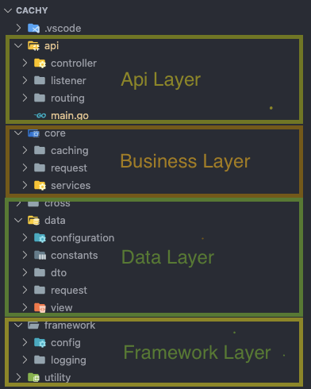

# cachy
 

## Table of Contents

- [cachy](#cachy)
  - [Table of Contents](#table-of-contents)
  - [Description](#description)
  - [Features](#features)
  - [Structure](#structure)
  - [Configurability](#configurability)
    - [settings.json](#settingsjson)
    - [default values for backup_file_path](#default-values-for-backup_file_path)
  - [Run on Local](#run-on-local)
    - [Step 1: git clone this repository hayrullahcansu/cachy@github](#step-1-git-clone-this-repository-hayrullahcansucachygithub)
    - [Step 2: init go environment](#step-2-init-go-environment)
    - [Step 3: download dependencies](#step-3-download-dependencies)
    - [Step 4: run test](#step-4-run-test)
    - [Step 4: run cachy (It will start to listen on 8080 default port) [env key: PORT]](#step-4-run-cachy-it-will-start-to-listen-on-8080-default-port-env-key-port)
  - [Test API](#test-api)
  - [Rest API Document](#rest-api-document)
  - [Docker](#docker)
  - [TODO](#todo)

---


## Description

Cachy is a lightweight in-memory cache api.

## Features

* No thirdparty libraries.
* Docker image.

## Structure


To be avoided from circular reference error, we have to obtain these rules. 

 * `Api Layer` includes controllers, request handlers, and routing files  should be here. You can just reference Business Layer, Data Layer and Framework Layer.

 * `Business Layer` includes all business logics, structures, service files. You can just reference Data layer and Framework layer.

 * `Data Layer` Models, DTOs, views, constants should be here. You `cannot reference any project`.

 * `Framework Layer` Global extension structures, methods, some helper methods without business. You can just reference Data layer.
  
## Configurability


### settings.json 

```json
{
  "backup_file_path": "TIMESTAMP-data.json", 
  "backup_interval": "30"   //by sec
}
```

| Param Name | Variable Type | Requirement | Description                         | Value                                                                             |
|------------|---------------|-------------|-------------------------------------|-------------------------------------------------------------------------------------|
| backup_file_path       | `:string`     |    no`*`   | Path for backing up                       |   Described below  |
| backup_interval      | `:string`     |    no`*`   | Interval for backing up         |  `10`, `30`, `60` ... by any seconds  |

### default values for backup_file_path
```
darwin   ->  "/tmp/TIMESTAMP-data.json"
linux    ->  "/tmp/TIMESTAMP-data.json"
windows  ->  "TIMESTAMP-data.json"
```
## Run on Local 

### Step 1: git clone this repository [hayrullahcansu/cachy@github](https://github.com/hayrullahcansu/cachy)
```
git clone https://github.com/hayrullahcansu/cachy.git
```

### Step 2: init go environment
```
go mod init github.com/hayrullahcansu/cachy
```
### Step 3: download dependencies
```
go mod download
```
### Step 4: run test
```
go test -v ./... 
```
### Step 4: run cachy (It will start to listen on 8080 default port) [env key: PORT]
```
go run ./api/main.go
```
```

└─(00:51:23 on master ✹)──> go run ./api/main.go               ──(Fri,Oct15)─┘
INFO: 2021/10/15 00:51:34 logging.go:65: Starting service for cachy
2021/10/15 00:51:34 Defaulting to port 8080
2021/10/15 00:51:34 Listening on port 8080
```
## Test API 

Hosted in heroku.

`https://cachy-api.herokuapp.com/api/v1`
## Rest API Document

All endpoints here
- Cache Resource `/api/v1/cache`
  - GET `/` List of all cache entries
  - GET `/{cache_key}` returns cache entry
    - Response body: 
    ```json
    {
        "key": "cachy_test_key",
        "value": "cachy_test_value",
        "expire_at": "13-10-2021 17:57:30"
    }
    ```
  - POST `/{cache_key}` sets new cache entry
    - Request body: 
    ```json
    {
        "time_span": 10,
        "data":"cachy_test_value"
    }
    ```
    - Response body: 
    ```json
    {
        "key": "cachy_test_key",
        "value": "cachy_test_value",
        "expire_at": "13-10-2021 17:57:30"
    }
    ```
  - PUT `/{cache_key}` updates existing cache entry
     - Request body: 
    ```json
    {
        "time_span": 20,
        "data":"cachy_test_value"
    }
    ```
      - Response body: 
    ```json
    {
        "key": "cachy_test_key",
        "value": "cachy_test_value",
        "expire_at": "13-10-2021 18:00:18"
    }
    ```

  - DELETE `/{cache_key}` removes cache entry
    
  - DELETE `/flush` removes all cache entries
    

## Docker

- Create docker image `docker build -t cachy-api --squash .` 
- Create/Run a docker container `docker run -d --rm -p 8080:8080 --name cachy-api-1 cachy-api` 
  
## TODO

- [x] Design Patters
- [x] Readme File
- [ ] Go Doc
- [x] ApiDoc
- [x] Tests
- [x] Logging for Http Requests that are incoming in `server.log` file
- [x] Docker Support
- [x] Deploy (Heroku, aws)